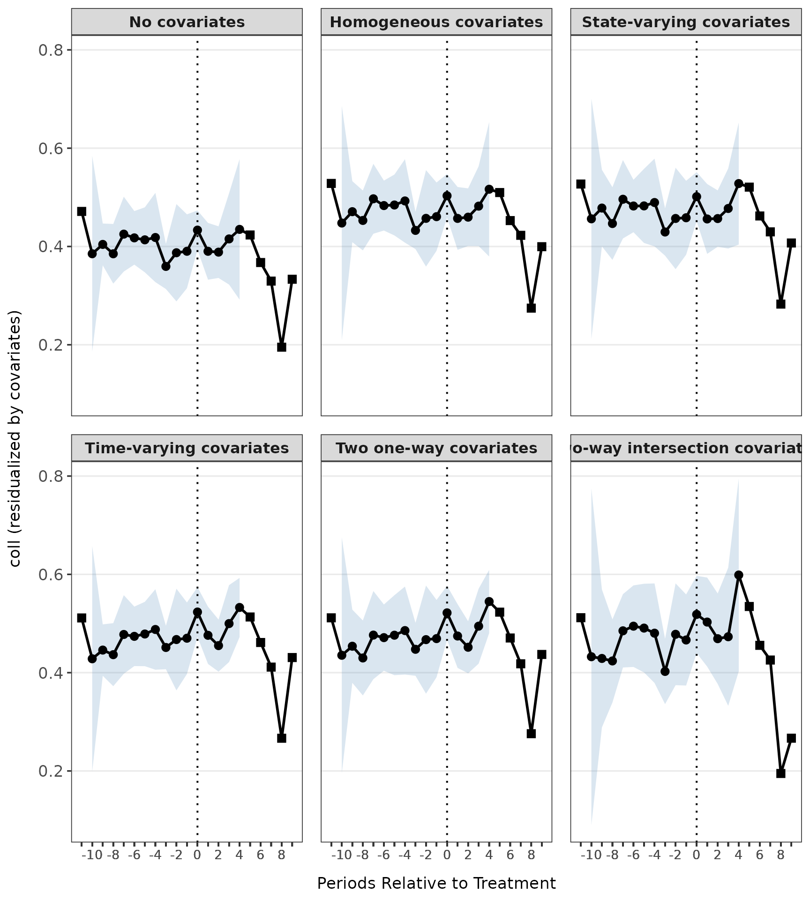
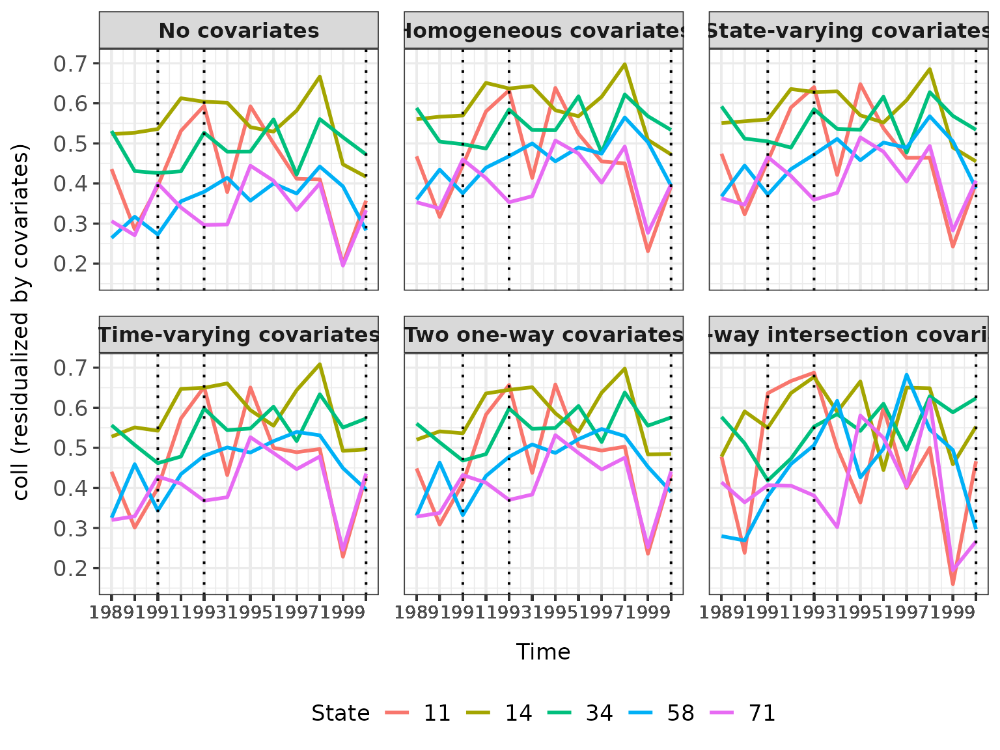

# didintrjl

``` r

library(didintrjl)
```

## Introduction

The **didintrjl** package is an R wrapper for the Julia package
[DiDInt.jl](https://ebjamieson97.github.io/DiDInt.jl/stable/), which
implements intersection difference-in-differences (DID-INT); a method
developed by [Karim & Webb (2025)](https://arxiv.org/abs/2412.14447).
DID-INT allows for unbiased estimation of the average treatment effect
on the treated (ATT) when the common causal covariates (CCC) assumption
is violated; that is, when the effects of covariates on the outcome of
interest may vary by state, time, or both. It supports common or
staggered adoption.

Because **didintrjl** interfaces with Julia via
[JuliaConnectoR](https://github.com/stefan-m-lenz/JuliaConnectoR), the
examples below require a working Julia installation with **DiDInt.jl**
available (see the README for installation details). They are evaluated
only when
[`juliaSetupOk()`](https://rdrr.io/pkg/JuliaConnectoR/man/juliaSetupOk.html)
returns `TRUE` and the **DiDInt.jl** package can be found.

The two functions are
[`didint()`](https://ebjamieson97.github.io/didintrjl/reference/didint.md),
which estimates ATT, and
[`didint_plot()`](https://ebjamieson97.github.io/didintrjl/reference/didint_plot.md),
which produces parallel trends or event study plots.

## 1. Estimation

[`didint()`](https://ebjamieson97.github.io/didintrjl/reference/didint.md)
returns an object of class `DiDIntObj` with three S3 methods:
[`print()`](https://rdrr.io/r/base/print.html),
[`summary()`](https://rdrr.io/r/base/summary.html), and
[`coef()`](https://rdrr.io/r/stats/coef.html). Each accepts a `level`
argument of either `"agg"` or `"sub"` to distinguish aggregate from
sub-aggregate results. In a staggered adoption setting with several
treatment times, `level = "sub"` returns results for the distinct
treatment times, whereas `level = "agg"` returns the aggregated results.

``` r

# Load the example data
df <- read.csv(system.file("extdata", "merit.csv", package = "didintrjl"))

# Estimate the ATT
res <- didint("coll", "state", "year", df, verbose = FALSE,
              treated_states = c(71, 58, 64, 59, 85, 57, 72, 61, 34, 88),
              treatment_times = c(1991, 1993, 1996, 1997, 1997, 1998,
                                  1998, 1999, 2000, 2000))

summary(res)
#> 
#>   Model Specification: Two-way DID-INT
#>   Weighting: both
#>   Aggregation: cohort
#>   Period Length: 1 year
#>   First Period: 1989
#>   Last Period: 2000
#>   Permutations: 999
#> 
#> Aggregate Results:
#>         ATT Std. Error     p-value RI p-value Jackknife SE Jackknife p-value
#>  0.04582252 0.01159691 0.007526681  0.1391391   0.01520398        0.00404305
#> 
#> Subaggregate Results:
#> Treatment Time              ATT         SE    p-value   RI p-val      JK SE   JK p-val     Weight
#> -------------------------------------------------------------------------------------------------------------- 
#> 1991-01-01               0.0529     0.0221     0.0172     0.5005         NA         NA     0.2018
#> 1993-01-01               0.0236     0.0166     0.1554     0.6937         NA         NA     0.1915
#> 1996-01-01               0.0564     0.0242     0.0208     0.4945         NA         NA     0.0757
#> 1997-01-01               0.0711     0.0230     0.0023     0.2062     0.0257     0.0080     0.3211
#> 1998-01-01               0.0485     0.0329     0.1427     0.4585     0.0838     0.5650     0.1086
#> 1999-01-01               0.0120     0.0150     0.4235     0.8759         NA         NA     0.0355
#> 2000-01-01              -0.0331     0.0320     0.3081     0.6847     0.0966     0.7336     0.0658

# Aggregate and sub-aggregate results can also be accessed directly
res$agg
#>          att         se        pval   ri_pval  jknife_se jknife_pval
#> 1 0.04582252 0.01159691 0.007526681 0.1391391 0.01520398  0.00404305
res$sub
#>        group         att         se        pval   ri_pval  jknife_se
#> 1 1991-01-01  0.05290996 0.02211803 0.017190246 0.5005005         NA
#> 2 1993-01-01  0.02359277 0.01657012 0.155433859 0.6936937         NA
#> 3 1996-01-01  0.05643511 0.02422739 0.020797631 0.4944945         NA
#> 4 1997-01-01  0.07111675 0.02296333 0.002287606 0.2062062 0.02574683
#> 5 1998-01-01  0.04854361 0.03290810 0.142653420 0.4584585 0.08378975
#> 6 1999-01-01  0.01204398 0.01497416 0.423539176 0.8758759         NA
#> 7 2000-01-01 -0.03306235 0.03203587 0.308102279 0.6846847 0.09660284
#>   jknife_pval    weights
#> 1          NA 0.20179564
#> 2          NA 0.19153484
#> 3          NA 0.07567336
#> 4 0.008012064 0.32107738
#> 5 0.564954173 0.10859342
#> 6          NA 0.03548525
#> 7 0.733597087 0.06584010
```

## 2. Plotting

[`didint_plot()`](https://ebjamieson97.github.io/didintrjl/reference/didint_plot.md)
returns an object of class `DiDIntPlotObj` with one S3 method:
[`plot()`](https://rdrr.io/r/graphics/plot.default.html). It can produce
either an event study plot (`event = TRUE`) or a parallel trends plot
(the default). The object also stores the underlying plotting data in
`DiDIntPlotObj$data`, so you can build your own customized plots if you
wish.

### 2.1 Event Study Plot

``` r

res_event <- didint_plot("coll", "state", "year", df, event = TRUE,
                         treated_states = c(71, 58, 64, 59, 85, 57,
                                            72, 61, 34, 88),
                         treatment_times = c(1991, 1993, 1996, 1997, 1997,
                                             1998, 1998, 1999, 2000, 2000),
                         covariates = c("asian", "black", "male"))

plot(res_event)
```



### 2.2 Parallel Trends Plot

``` r

# Using a subset of states to keep the plot readable
df_sub <- df[df$state %in% c(71, 58, 11, 34, 14), ]
res_parallel <- didint_plot("coll", "state", "year", df_sub,
                            treatment_times = c(1991, 1993, 2000),
                            covariates = c("asian", "black", "male"))

plot(res_parallel)
```



For both plot types you can choose which combination of plots to view
via the `ccc` argument, e.g. `plot(res_parallel, ccc = "state")` or
`plot(res_event, ccc = c("none", "hom", "int"))`. The plotting data
itself is available via `res_parallel$data` and `res_event$data`.

## References

You can access citations by calling `citation("didintrjl")`.

Karim, S. and Webb, M. D. 2025. Good Controls Gone Bad:
Difference-in-Differences with Covariates. arXiv preprint
arXiv:2412.14447. <https://arxiv.org/abs/2412.14447>
