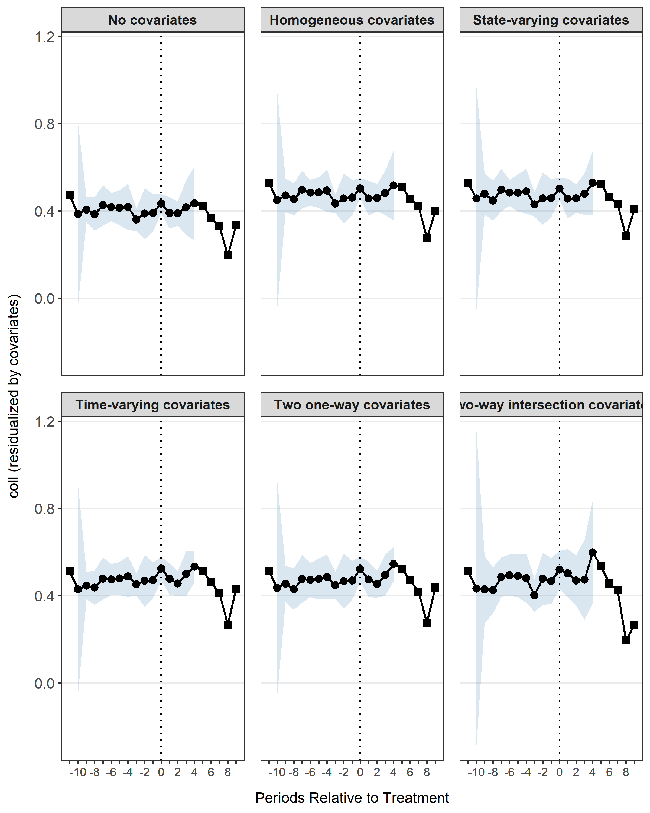
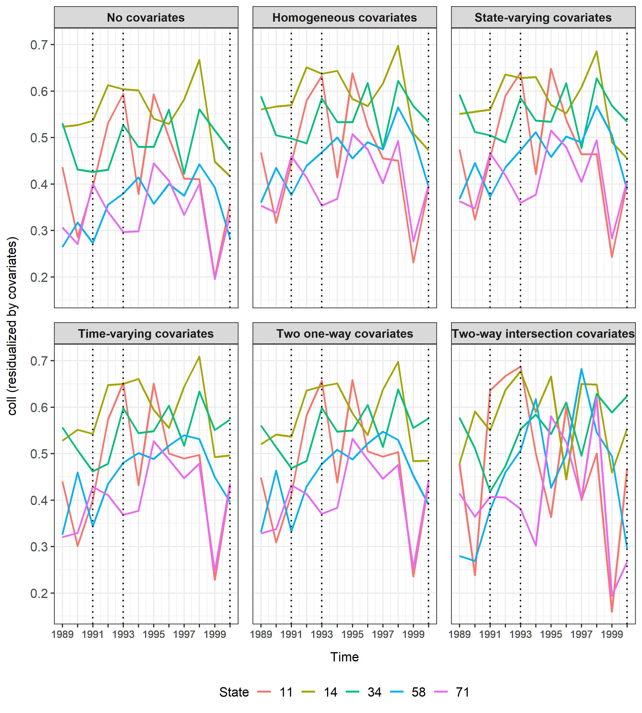
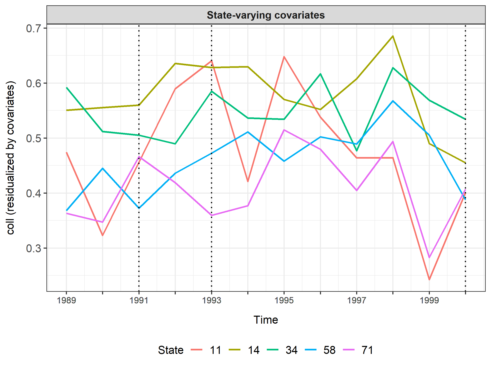

# didintrjl

**didintrjl** is an R wrapper for the Julia package
[DiDInt.jl](https://ebjamieson97.github.io/DiDInt.jl/dev/), which
implements intersection difference-in-differences (DID-INT), a method
developed by [Karim & Webb (2025)](https://arxiv.org/abs/2412.14447).
DID-INT allows for unbiased estimation of the average effect of
treatment on the treated (ATT) in cases when the common causal
covariates (CCC) assumption is violated.

## Installation

You can install the development version of didintrjl with:

``` r
# install.packages("remotes")
remotes::install_github("ebjamieson97/didintrjl")
```

Since **didintrjl** is a wrapper for the Julia pacakage
[DiDInt.jl](https://ebjamieson97.github.io/DiDInt.jl/dev/), you may need
to update the Julia package itself from time to time. You can do this
directly from R using the brilliant
[JuliaConnectoR](https://ebjamieson97.github.io/didintrjl/github.com/stefan-m-lenz/JuliaConnectoR)
which is the package that **didintrjl** uses to interface with Julia.

``` r
library(JuliaConnectoR)
juliaEval('using Pkg; Pkg.add(url="https://github.com/ebjamieson97/DiDInt.jl")')
```

## Requirements

- Julia \>= 1.10.0
- DiDInt.jl = v0.6.15

## Examples

### `didint()`

The
[`didint()`](https://ebjamieson97.github.io/didintrjl/reference/didint.md)
function returns an object with the class `DiDIntObj` which has three S3
methods: [`print()`](https://rdrr.io/r/base/print.html),
[`summary()`](https://rdrr.io/r/base/summary.html), and
[`coef()`](https://rdrr.io/r/stats/coef.html). Each of these methods
have the argument `level` which can take either `"agg"` or `"sub"` in
order to distinguish between aggregate results and sub-aggregate
results. For example, in a staggered adoption setting with several
different treatment times, setting `level = "sub"` will return
information pertinent to the distinct treatment times, whereas
`level = "agg"` would return the aggregated results.

``` r
# Load data
df <- read.csv("inst/extdata/merit.csv")

# Load didintrjl and run didint()
library(didintrjl)
res <- didint("coll", "state", "year", df, verbose = FALSE,
              treated_states = c(71, 58, 64, 59, 85, 57, 72, 61, 34, 88),
              treatment_times = c(1991, 1993, 1996, 1997, 1997, 1998, 1998, 1999, 2000, 2000))
#> Starting Julia ...

# Show summary of results
summary(res)
#> 
#>   Model Specification: Two-way DID-INT
#>   Weighting: both
#>   Aggregation: cohort
#>   Period Length: 1 year
#>   First Period: 1989
#>   Last Period: 2000
#>   Permutations: 999
#> 
#> Aggregate Results:
#>         ATT Std. Error    p-value RI p-value Jackknife SE Jackknife p-value
#>  0.04582252 0.01440005 0.01902511  0.1081081   0.01333186         0.0138506
#> 
#> Subaggregate Results:
#> Treatment Time              ATT         SE    p-value   RI p-val      JK SE   JK p-val     Weight
#> -------------------------------------------------------------------------------------------------------------- 
#> 1991-01-01               0.0529     0.0244     0.0307     0.4945     0.0244     0.0305     0.2018
#> 1993-01-01               0.0236     0.0186     0.2044     0.6997     0.0185     0.2037     0.1915
#> 1996-01-01               0.0564     0.0295     0.0572     0.4775     0.0294     0.0566     0.0757
#> 1997-01-01               0.0711     0.0271     0.0094     0.1932     0.0270     0.0092     0.3211
#> 1998-01-01               0.0485     0.0389     0.2146     0.4685     0.0388     0.2128     0.1086
#> 1999-01-01               0.0120     0.0207     0.5629     0.8739     0.0206     0.5606     0.0355
#> 2000-01-01              -0.0331     0.0976     0.7364     0.6977     0.0964     0.7334     0.0658

# The aggregate and sub-aggregate results can also be accessed via
res$agg
#>          att         se       pval   ri_pval  jknife_se jknife_pval
#> 1 0.04582252 0.01440005 0.01902511 0.1081081 0.01333186   0.0138506
res$sub
#>        group         att         se        pval   ri_pval  jknife_se
#> 1 1991-01-01  0.05290996 0.02439807 0.030675438 0.4944945 0.02436901
#> 2 1993-01-01  0.02359277 0.01855183 0.204356636 0.6996997 0.01852420
#> 3 1996-01-01  0.05643511 0.02950858 0.057186077 0.4774775 0.02943824
#> 4 1997-01-01  0.07111675 0.02705265 0.009353063 0.1931932 0.02697389
#> 5 1998-01-01  0.04854361 0.03891876 0.214580478 0.4684685 0.03876762
#> 6 1999-01-01  0.01204398 0.02073484 0.562929773 0.8738739 0.02061105
#> 7 2000-01-01 -0.03306235 0.09756409 0.736430972 0.6976977 0.09642295
#>   jknife_pval    weights
#> 1 0.030478102 0.20179564
#> 2 0.203684129 0.19153484
#> 3 0.056599508 0.07567336
#> 4 0.009152352 0.32107738
#> 5 0.212809403 0.10859342
#> 6 0.560591878 0.03548525
#> 7 0.733434003 0.06584010
```

### `didint_plot()`

The
[`didint_plot()`](https://ebjamieson97.github.io/didintrjl/reference/didint_plot.md)
function returns an object of the class `DiDIntPlotObj` which has one S3
method: [`plot()`](https://rdrr.io/r/graphics/plot.default.html). This
object also stores the data used to create the plot so that users may
directly access the plotting data and create their own customized plots.
[`didint_plot()`](https://ebjamieson97.github.io/didintrjl/reference/didint_plot.md)
can produce either parallel trends plots or event study plots.

``` r
# Generate the DiDIntPlotObj for event study plot
res_event <- didint_plot(
  "coll", "state", "year", df, event = TRUE,
  treated_states = c(71, 58, 64, 59, 85, 57, 72, 61, 34, 88),
  treatment_times = c(1991, 1993, 1996, 1997, 1997, 1998, 1998, 1999,
                      2000, 2000),
  covariates = c("asian", "black", "male")
)
#>     Demean Variables: [=>                               ]  1/121

plot(res_event)
```



``` r

# For purposes of demonstration, it would be a bit cluttered to show the
# parallel trends for each state in the dataset, so here we will just use
# a subset
df_sub <- df[df$state %in% c(71, 58, 11, 34, 14), ]
res_parallel <- didint_plot("coll", "state", "year", df_sub,
                            treatment_times = c(1991, 1993, 2000),
                            covariates = c("asian", "black", "male"))

plot(res_parallel)
```



For both the event study plots and the parallel trends plots it is
possible to specify which combination of plots you would like to view
via the `ccc` argument.

``` r

plot(res_parallel, ccc = "state")
```



``` r
plot(res_event, ccc = c("none", "hom", "int"))
```


If you would like to create your own customized plots using the plotting
data, you can acccess it via `DiDIntPlotObj$data`.

``` r
head(res_parallel$data)
#>   state time    lambda ccc period start_date treat_period period_length
#> 1    11 1989 0.4676477 hom      0       1989           NA        1 year
#> 2    11 1990 0.3166708 hom      1       1989           NA        1 year
#> 3    11 1991 0.4455335 hom      2       1989           NA        1 year
#> 4    11 1992 0.5796195 hom      3       1989           NA        1 year
#> 5    11 1993 0.6324456 hom      4       1989           NA        1 year
#> 6    11 1994 0.4139365 hom      5       1989           NA        1 year
head(res_event$data)
#>   ccc time_since_treatment         y         se    ci_lower  ci_upper ngroup
#> 1 hom                  -11 0.5282917 0.24299986 -2.55931420 3.6158976      2
#> 2 hom                  -10 0.4476755 0.11609859 -0.05185644 0.9472074      3
#> 3 hom                   -9 0.4708055 0.02783482  0.39352366 0.5480874      5
#> 4 hom                   -8 0.4529724 0.03014100  0.37922005 0.5267248      7
#> 5 hom                   -7 0.4970207 0.03668203  0.41028149 0.5837599      8
#> 6 hom                   -6 0.4832311 0.02483194  0.42451293 0.5419493      8
#>   period_length
#> 1        1 year
#> 2        1 year
#> 3        1 year
#> 4        1 year
#> 5        1 year
#> 6        1 year
```
